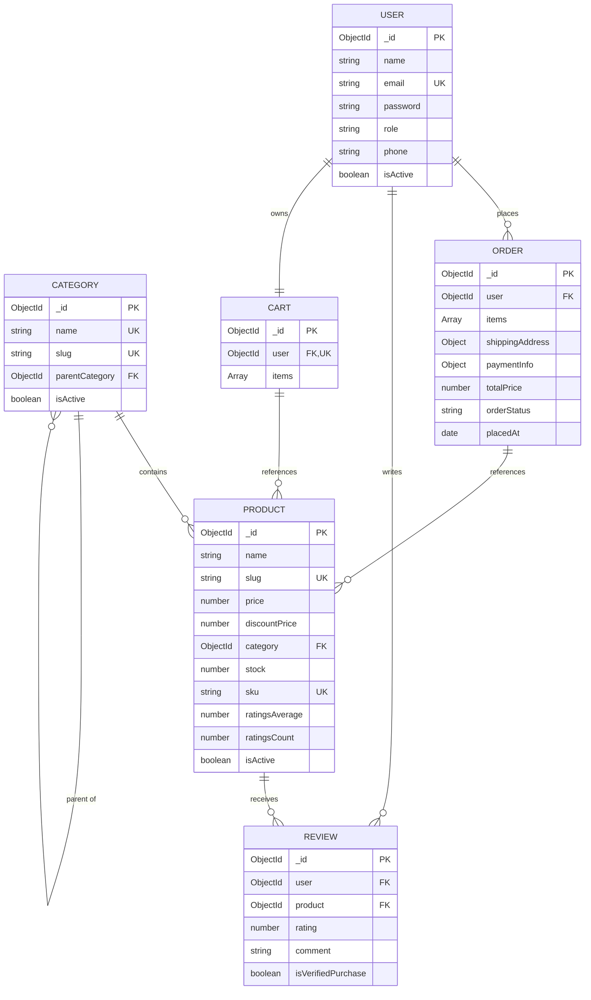

# 🗄️ Database Schema & Entity Relationships

This document details the MongoDB database schema for the E-Commerce platform built with Mongoose.

---

## 📐 Entity-Relationship Diagram (ERD)

---

## 📋 Collection Schemas

### 1. User Collection (`users`)

Stores customer and administrator credentials, profile details, and shipping addresses.

| Field | Type | Constraints | Default | Ref / Description |
|-------|------|-------------|---------|-------------------|
| `_id` | `ObjectId` | Auto-generated PK | — | Primary Key |
| `name` | `String` | Required, Max: 100, Trim | — | Full name of the user |
| `email` | `String` | Required, Unique, Lowercase, Trim, Regex Email | — | Primary login credential & contact email |
| `password` | `String` | Required, Min: 8, `select: false` | — | Bcrypt hashed password (salt factor 12) |
| `role` | `String` | Enum: `['customer', 'admin']` | `'customer'` | Role-based authorization control |
| `addresses` | `Array<Address>` | Max: 10 items | `[]` | Embedded sub-documents |
| `addresses[].label` | `String` | Required, Trim, Max: 50 | — | Address label e.g., "Home", "Office" |
| `addresses[].line1` | `String` | Required, Trim | — | Street address line 1 |
| `addresses[].line2` | `String` | Trim | — | Apartment, suite, unit (optional) |
| `addresses[].city` | `String` | Required, Trim | — | City name |
| `addresses[].state` | `String` | Required, Trim | — | State / Province |
| `addresses[].pincode` | `String` | Required, Trim | — | ZIP / Postal code |
| `addresses[].country` | `String` | Required, Trim | `'India'` | Country name |
| `addresses[].isDefault` | `Boolean` | — | `false` | Default shipping address flag |
| `phone` | `String` | Trim, Phone Regex | — | Contact telephone number |
| `avatar` | `String` | — | — | Cloudinary image URL |
| `isActive` | `Boolean` | — | `true` | Account active status |
| `passwordChangedAt` | `Date` | — | — | Timestamp of last password modification |
| `passwordResetToken` | `String` | `select: false` | — | Hashed token for password reset |
| `passwordResetExpires` | `Date` | `select: false` | — | Expiration time for reset token |
| `createdAt` | `Date` | Timestamps | Auto | Record creation timestamp |
| `updatedAt` | `Date` | Timestamps | Auto | Record update timestamp |

**Indexes:**
- `{ email: 1 }` (Unique)
- `{ role: 1 }`
- `{ createdAt: -1 }`

---

### 2. Category Collection (`categories`)

Hierarchical product categories supporting parent/child relationships.

| Field | Type | Constraints | Default | Ref / Description |
|-------|------|-------------|---------|-------------------|
| `_id` | `ObjectId` | Auto-generated PK | — | Primary Key |
| `name` | `String` | Required, Unique, Trim, Max: 100 | — | Category name |
| `slug` | `String` | Unique, Lowercase, Trim | Auto | URL-friendly slug generated from `name` |
| `description` | `String` | Trim, Max: 500 | — | Short overview of the category |
| `image` | `String` | — | — | Cloudinary banner/icon URL |
| `parentCategory` | `ObjectId` | Optional | `null` | **Ref: Category** (Self-reference) |
| `isActive` | `Boolean` | — | `true` | Visibility flag |
| `createdAt` | `Date` | Timestamps | Auto | Record creation timestamp |
| `updatedAt` | `Date` | Timestamps | Auto | Record update timestamp |

**Virtuals:**
- `subCategories`: Reverse-populates child categories (`parentCategory == _id`)

**Indexes:**
- `{ name: 1 }` (Unique)
- `{ slug: 1 }` (Unique)
- `{ parentCategory: 1 }`
- `{ isActive: 1 }`

---

### 3. Product Collection (`products`)

Contains catalog items available for browsing and purchasing.

| Field | Type | Constraints | Default | Ref / Description |
|-------|------|-------------|---------|-------------------|
| `_id` | `ObjectId` | Auto-generated PK | — | Primary Key |
| `name` | `String` | Required, Trim, Max: 200 | — | Product title |
| `slug` | `String` | Unique, Lowercase, Trim | Auto | URL slug (auto-appends SKU on collision) |
| `description` | `String` | Required, Trim, Max: 5000 | — | Detailed product description |
| `price` | `Number` | Required, Min: 0 | — | Standard retail price |
| `discountPrice` | `Number` | Min: 0, Must be < price | — | Promotional price (optional) |
| `category` | `ObjectId` | Required | — | **Ref: Category** |
| `images` | `Array<String>` | Max: 10 items | `[]` | Array of Cloudinary image URLs |
| `stock` | `Number` | Required, Min: 0 | `0` | Available inventory quantity |
| `sku` | `String` | Required, Unique, Uppercase, Trim | — | Stock Keeping Unit identifier |
| `brand` | `String` | Trim, Max: 100 | — | Brand or manufacturer name |
| `ratingsAverage` | `Number` | Min: 0, Max: 5, Rounded to 1 decimal | `0` | Average star rating |
| `ratingsCount` | `Number` | Min: 0 | `0` | Total number of reviews received |
| `isActive` | `Boolean` | — | `true` | Product listing status |
| `createdAt` | `Date` | Timestamps | Auto | Record creation timestamp |
| `updatedAt` | `Date` | Timestamps | Auto | Record update timestamp |

**Virtuals:**
- `effectivePrice`: Returns `discountPrice ?? price`
- `discountPercent`: Calculates percentage savings
- `reviews`: Reverse-populates product reviews (`product == _id`)

**Indexes:**
- `{ name: 'text', description: 'text', brand: 'text' }` (Weights: name=10, brand=5, description=1)
- `{ slug: 1 }` (Unique)
- `{ sku: 1 }` (Unique)
- `{ category: 1 }`
- `{ price: 1 }`
- `{ ratingsAverage: -1 }`
- `{ isActive: 1 }`
- `{ isActive: 1, category: 1, ratingsAverage: -1 }` (Compound)

---

### 4. Cart Collection (`carts`)

Maintains active shopping cart state per user.

| Field | Type | Constraints | Default | Ref / Description |
|-------|------|-------------|---------|-------------------|
| `_id` | `ObjectId` | Auto-generated PK | — | Primary Key |
| `user` | `ObjectId` | Required, Unique | — | **Ref: User** (One cart per user) |
| `items` | `Array<CartItem>` | Max: 50 items | `[]` | Array of cart item sub-documents |
| `items[]._id` | `ObjectId` | Sub-doc PK | Auto | Unique ID for cart item |
| `items[].product` | `ObjectId` | Required | — | **Ref: Product** |
| `items[].quantity` | `Number` | Required, Min: 1, Max: 100 | — | Selected quantity |
| `items[].priceAtAdd` | `Number` | Required, Min: 0 | — | Price locked when added to cart |
| `createdAt` | `Date` | Timestamps | Auto | Record creation timestamp |
| `updatedAt` | `Date` | Timestamps | Auto | Record update timestamp |

**Virtuals:**
- `totalItems`: Sum of item quantities in cart
- `totalPrice`: Sum of `(priceAtAdd * quantity)` across items

**Indexes:**
- `{ user: 1 }` (Unique)
- `{ 'items.product': 1 }`

---

### 5. Order Collection (`orders`)

Stores purchase records, item snapshots, delivery addresses, and payment information.

| Field | Type | Constraints | Default | Ref / Description |
|-------|------|-------------|---------|-------------------|
| `_id` | `ObjectId` | Auto-generated PK | — | Primary Key |
| `user` | `ObjectId` | Required | — | **Ref: User** |
| `items` | `Array<OrderItem>` | Required, Min: 1 item | — | Snapshot of ordered products |
| `items[].product` | `ObjectId` | Required | — | **Ref: Product** |
| `items[].name` | `String` | Required | — | Product name snapshot |
| `items[].price` | `Number` | Required, Min: 0 | — | Item purchase price snapshot |
| `items[].quantity` | `Number` | Required, Min: 1 | — | Purchased quantity |
| `items[].image` | `String` | Required | — | Thumbnail image snapshot |
| `shippingAddress` | `ShippingAddress` | Required | — | Embedded sub-document |
| `shippingAddress.fullName` | `String` | Required | — | Recipient full name |
| `shippingAddress.line1` | `String` | Required | — | Address line 1 |
| `shippingAddress.line2` | `String` | — | — | Address line 2 |
| `shippingAddress.city` | `String` | Required | — | City |
| `shippingAddress.state` | `String` | Required | — | State |
| `shippingAddress.pincode` | `String` | Required | — | Postal code |
| `shippingAddress.country` | `String` | Required | `'India'` | Country |
| `shippingAddress.phone` | `String` | Required | — | Recipient phone number |
| `paymentInfo` | `PaymentInfo` | Required | — | Embedded sub-document |
| `paymentInfo.method` | `String` | Enum: `['razorpay', 'cod', 'wallet']` | — | Payment method |
| `paymentInfo.status` | `String` | Enum: `['pending', 'paid', 'failed', 'refunded']` | `'pending'` | Payment status |
| `paymentInfo.transactionId` | `String` | — | — | Gateway transaction / payment ID |
| `paymentInfo.paidAt` | `Date` | — | — | Payment completion timestamp |
| `itemsPrice` | `Number` | Required, Min: 0 | — | Sum of items cost |
| `taxPrice` | `Number` | Required, Min: 0 | `0` | Calculated tax |
| `shippingPrice` | `Number` | Required, Min: 0 | `0` | Delivery fee |
| `totalPrice` | `Number` | Required, Min: 0 | — | Final order total |
| `orderStatus` | `String` | Enum: `['pending', 'processing', 'shipped', 'delivered', 'cancelled']` | `'pending'` | Order processing state |
| `placedAt` | `Date` | — | `Date.now` | Order placement timestamp |
| `deliveredAt` | `Date` | — | — | Auto-set when `orderStatus` becomes `'delivered'` |
| `cancelledAt` | `Date` | — | — | Auto-set when `orderStatus` becomes `'cancelled'` |
| `cancelReason` | `String` | Max: 500 | — | Cancellation reason |
| `createdAt` | `Date` | Timestamps | Auto | Record creation timestamp |
| `updatedAt` | `Date` | Timestamps | Auto | Record update timestamp |

**Indexes:**
- `{ user: 1, createdAt: -1 }` (Compound)
- `{ orderStatus: 1 }`
- `{ 'paymentInfo.status': 1 }`
- `{ 'paymentInfo.transactionId': 1 }` (Sparse)
- `{ placedAt: -1 }`
- `{ createdAt: -1 }`

---

### 6. Review Collection (`reviews`)

Stores ratings and reviews left by customers for products.

| Field | Type | Constraints | Default | Ref / Description |
|-------|------|-------------|---------|-------------------|
| `_id` | `ObjectId` | Auto-generated PK | — | Primary Key |
| `user` | `ObjectId` | Required | — | **Ref: User** |
| `product` | `ObjectId` | Required | — | **Ref: Product** |
| `rating` | `Number` | Required, Min: 1, Max: 5 | — | Star rating (1 to 5) |
| `comment` | `String` | Required, Trim, Min: 10, Max: 1000 | — | Review body text |
| `isVerifiedPurchase` | `Boolean` | — | `false` | `true` if user purchased item |
| `helpfulVotes` | `Number` | Min: 0 | `0` | Count of helpful votes |
| `createdAt` | `Date` | Timestamps | Auto | Record creation timestamp |
| `updatedAt` | `Date` | Timestamps | Auto | Record update timestamp |

**Hooks:**
- Post-save & Post-deleteOne: Recalculates `ratingsAverage` and `ratingsCount` on the target `Product` via aggregation.

**Indexes:**
- `{ user: 1, product: 1 }` (Unique - One review per user per product)
- `{ product: 1, rating: -1 }`
- `{ user: 1, createdAt: -1 }`
- `{ rating: 1 }`
